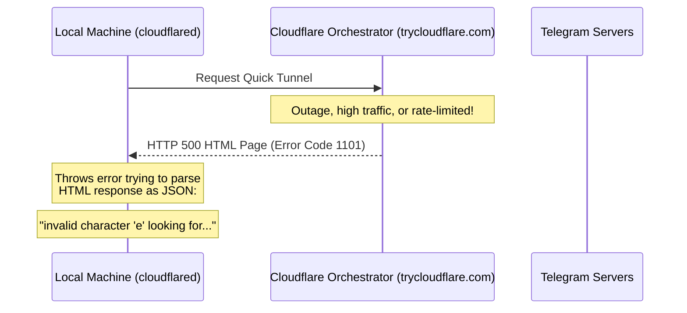

# Cloudflare Tunnel Troubleshooting & Stability Guide

If you encountered a `500 Internal Server Error` with an unmarshaling error starting with `'e'` (e.g., `invalid character 'e' looking for beginning of value`), **you did not break anything.** 

This guide explains why this happens, how to get back up and running immediately, and how to migrate to highly stable, permanent alternatives.

---

## 🔍 Why Did This Happen?

When you run `capture-url.ps1`, it starts an account-less **Quick Tunnel** on Cloudflare's public playground (`trycloudflare.com`). 



### The Root Cause
Because `trycloudflare.com` is a free public sandbox with no uptime guarantees, its orchestration API is subject to heavy rate-limiting and temporary outages. When this happens:
1. The orchestration server responds with an **HTML error page** (like a Cloudflare WAF block or error `1015`/`1101`) instead of the expected JSON data.
2. The `cloudflared` client tries to parse the HTML string `error...` as JSON, which fails with the Go-unmarshaling error: `invalid character 'e' looking for beginning of value`.

---

## ⚡ Solution 1: Immediate Recovery (Tested & Verified)

> [!NOTE]
> We have just tested the `trycloudflare.com` service, and the public server is **back online**!

To get back to work immediately:
1. Close the command prompt window titled **`Cloudflared | Project`** (or press `Ctrl+C` in it to stop it).
2. Close the command prompt window titled **`Webhook | Project`** (or press `Ctrl+C` in it).
3. Rerun `start-dev.bat` from your terminal or double-click it. 

The scripts will automatically clean up the old state, request a new tunnel, write the fresh URL to `.env.local`, register the Telegram webhook, and restart Next.js automatically!

---

## 🏆 Solution 2: Set Up a Free Named Tunnel (Recommended for Production)

If you want a **100% stable**, permanent URL that never changes (meaning you **never** have to re-register webhooks or send `/app` to the Telegram bot again), you can set up a Cloudflare **Named Tunnel** on a free account.

### Why use a Named Tunnel?
* **Permanent Domain:** Use a static subdomain like `dev.yourdomain.com`.
* **Zero Webhook Churn:** You register your Telegram webhook once and never touch it again.
* **No Rate Limits:** Bypass all the public sandbox rate-limiting blocks.

### Step-by-Step Setup:
1. **Sign Up / Log In:** Go to [Cloudflare Dashboard](https://dash.cloudflare.com/) and add a domain (you can get super cheap `.xyz` or `.club` domains for $1–$2/year if you don't own one).
2. **Access Zero Trust:** Click on **Zero Trust** in the left sidebar.
3. **Create Tunnel:** Go to **Networks** -> **Tunnels** -> **Add a Tunnel**.
   * Choose **Cloudflare Tunnel (connector)**.
   * Name your tunnel (e.g., `local-dev`).
4. **Install & Run Connector:**
   * Under the **Choose Environment** tab, copy the **token** provided in the install command (it's a long base64 string).
   * You can run the connector locally by installing the service or just running:
     ```bash
     cloudflared tunnel run --token <YOUR_TOKEN_HERE>
     ```
5. **Route Traffic:**
   * Go to the **Public Hostname** tab.
   * Add a Public Hostname: e.g., Subdomain: `dev`, Domain: `yourdomain.com`.
   * Service Type: `HTTP`, URL: `localhost:3000`.

### Integrating Named Tunnel into your codebase:
Once you have your persistent URL (e.g., `https://dev.yourdomain.com`):
1. **Disable capture scripts:** You no longer need to auto-capture or spin up cloudflared dynamically!
2. **Update `.env.local`:**
   ```env
   NEXT_PUBLIC_SITE_URL=https://dev.yourdomain.com
   APP_URL=https://dev.yourdomain.com
   ```
3. **Register Webhook Once:** Just run a one-time script or visit `https://api.telegram.org/bot<TOKEN>/setWebhook?url=https://dev.yourdomain.com/api/telegram/webhook` in your browser.

---

## 🛠️ Solution 3: Free Zero-Setup Fallbacks (Ngrok & Localtunnel)

If you don't have a domain name but need an instant, highly reliable fallback when `trycloudflare.com` acts up, you can use these free alternatives:

### Option A: Localtunnel (Easiest, No Signup)
Localtunnel is completely free and requires zero configuration.
1. Run localtunnel on port `3000`:
   ```bash
   npx localtunnel --port 3000
   ```
2. It will output a public URL (e.g., `https://cold-foxes-sing.localtunnel.me`).
3. Manually copy this URL, paste it into `.env.local` under `NEXT_PUBLIC_SITE_URL` and `APP_URL`, and restart Next.js.
4. Call your webhook registration script.

### Option B: Ngrok (Extremely Stable, Free Static Subdomain)
Ngrok now gives free accounts one **permanent static subdomain**!
1. Sign up for a free account at [ngrok.com](https://ngrok.com/).
2. Connect your agent with your authtoken (shown on dashboard):
   ```bash
   ngrok config add-authtoken <your-token>
   ```
3. Claim your free static domain in the ngrok dashboard (e.g., `https://yourname.ngrok-free.app`).
4. Start your tunnel:
   ```bash
   ngrok http 3000 --url yourname.ngrok-free.app
   ```
5. Save `https://yourname.ngrok-free.app` directly into `.env.local`. You will never have to change it again!
